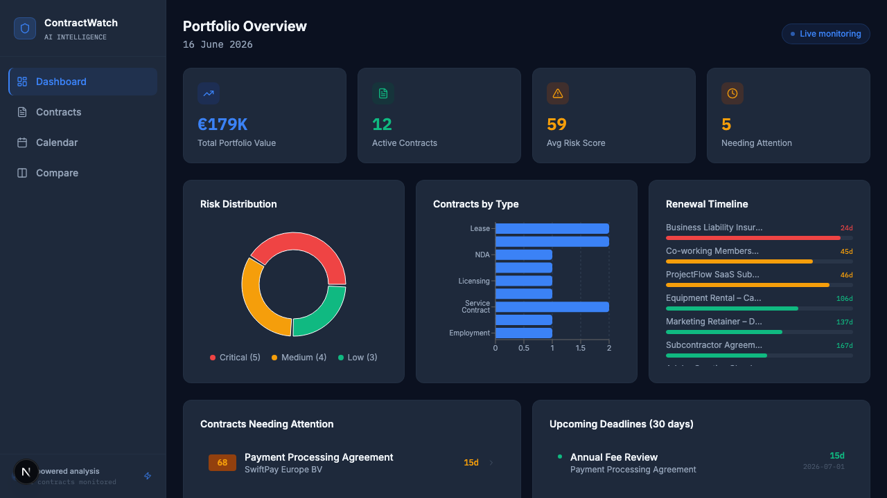
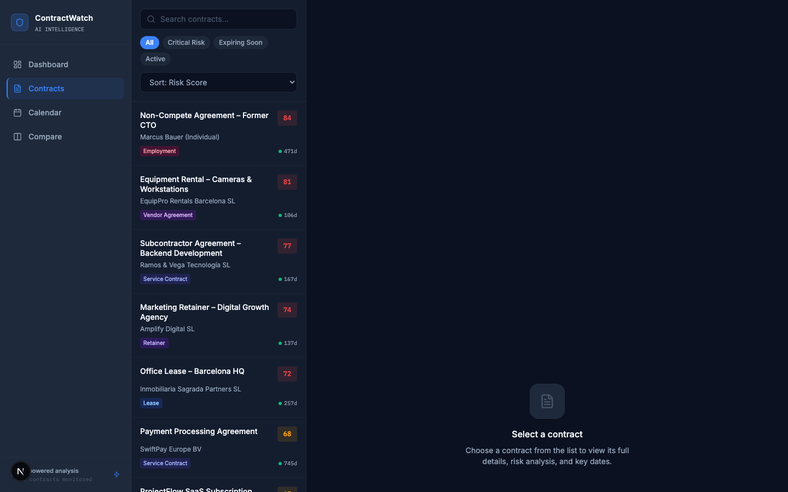
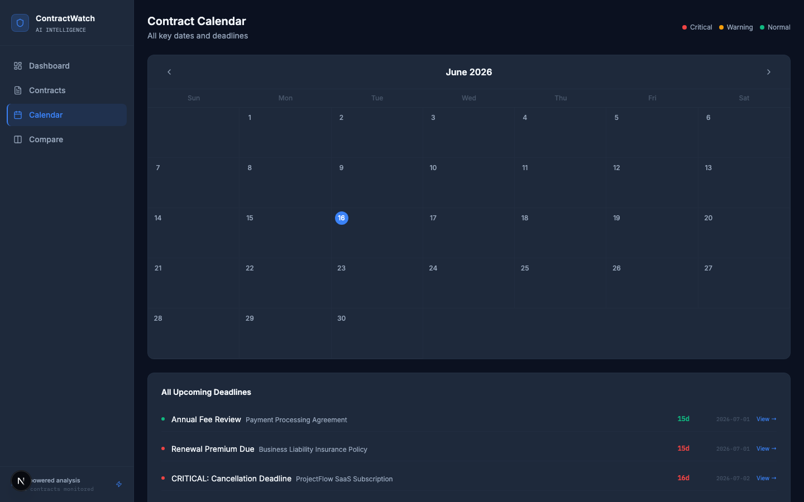
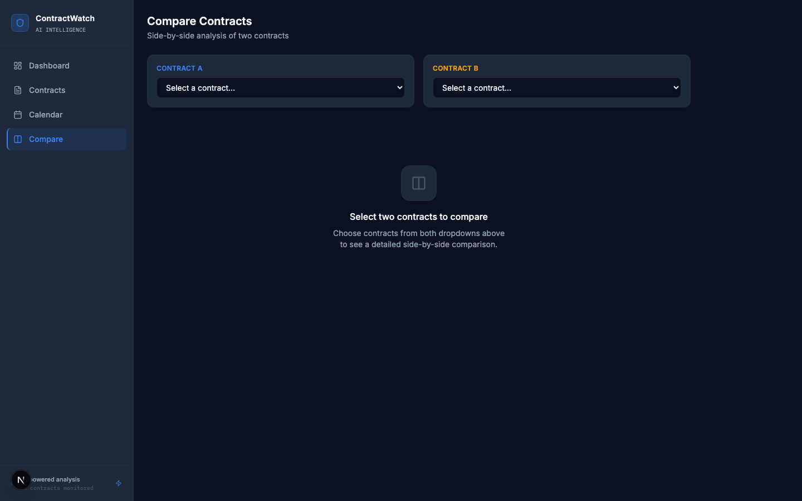

# ContractWatch


**Enterprise-grade AI contract intelligence platform.** ContractWatch analyzes contracts for risk, extracts obligations and deadlines, tracks renewal cycles, compares contracts side-by-side, and delivers negotiation intelligence — all from a production-quality SaaS dashboard.

> Portfolio showcase built on realistic mock data. Architected for real LLM + OCR pipeline drop-in. Feels like a $50k/year legal-tech product.

---

## Screenshots

| Dashboard | Contract List |
|-----------|--------------|
|  |  |

| Calendar | Compare |
|----------|---------|
|  |  |

---

## Features

### 🔴 Risk Flagging Engine
- Every clause tagged: Critical / Medium / Low risk
- 9 risk categories: Auto-renewal traps, Unlimited liability, One-sided termination, Vague payment terms, Broad indemnification, Non-compete overreach, IP ownership ambiguity, Missing liability cap, Unfavorable jurisdiction
- Overall risk score 0–100 with visual radial gauge
- Risk breakdown by category as horizontal bar chart

### 📅 Deadline & Obligation Tracking
- Extracts: renewal dates, cancellation windows, payment due dates, milestones, expiry
- Master calendar view across all contracts, color-coded by urgency
- "Upcoming in 30 days" widget on main dashboard
- Auto-calculated notice deadlines (e.g. 60-day cancellation notice → action deadline)
- Recurring obligations tracker

### 📝 Plain-Language Summaries
- Structured AI summary per contract: what it is, term, obligations, biggest risk, recommended action
- Clause-level explanations: plain-language translation + why it matters + favorable alternative

### ⚖️ Contract Comparison
- Select any 2 contracts for side-by-side comparison
- Term, value, risk score, expiry, status, and clause-by-clause diff
- Highlights differences in payment terms, liability caps, termination clauses

### 📊 Portfolio Analytics Dashboard
- Total contract value under management
- Risk distribution donut chart (critical / medium / low)
- Contracts by type bar chart
- Renewal timeline — Gantt-style bars by expiry proximity
- Priority queue: contracts sorted by urgency score (risk × deadline proximity)

### 🧠 Negotiation Intelligence
- Suggested redline for every high-risk clause — original vs. AI-suggested fairer alternative
- Negotiation leverage score per clause (high / medium / low)
- Market-standard comparison heuristics

### 🔍 Search & Filter
- Global search by contract name, counterparty, clause content
- Filter by risk level, type, status, counterparty
- Sort by risk score, days to deadline, contract value, date

---

## How It Works — The Analyzer

`lib/analyzer.ts` contains the mock AI logic. Each function is marked `// REPLACE_WITH_LLM` where a real LLM or OCR call would slot in:

| Function | What it does | Real replacement |
|----------|-------------|-----------------|
| `analyzeClauseRisk()` | Keyword/pattern heuristics on clause text | Claude API with structured output |
| `generateSummary()` | Builds plain-language contract summary | LLM prompt with contract data |
| `generateRedline()` | Returns fairer alternative clause text | LLM few-shot redlining prompt |
| `calculateUrgency()` | Date math from today + notice period | Same (pure logic, no LLM needed) |
| `calculateLeverageScore()` | Category × contract-type heuristic | LLM + market database lookup |
| `calculatePortfolioRisk()` | Aggregate metrics across all contracts | Same (pure logic) |

### Risk Detection Patterns

The analyzer flags clauses containing:
- `"automatic renewal"`, `"automatically renew"` → Auto-Renewal (Critical)
- `"unlimited liability"` → Unlimited Liability (Critical)
- `"sole discretion"` → Unilateral Control (Critical)
- `"non-cancellable"` → Termination Restriction (Critical)
- `"perpetual"`, `"irrevocable"` → Perpetual/Irrevocable Rights (Critical)
- `"indemnif"` → Broad Indemnification (Critical)
- `"non-compete"` → Non-Compete (Critical)
- `"intellectual property"` → IP Ownership (Medium)
- `"limitation of liability"` → Liability Cap (Medium)
- `"governing law"` → Jurisdiction (Medium)
- `"price adjustment"`, `"price increase"` → Price Escalation (Medium)

---

## Mock Data

12 realistic contracts for a small creative/tech agency (Barcelona context):

| # | Contract | Type | Value | Risk | Status |
|---|----------|------|-------|------|--------|
| 1 | Office Lease – Barcelona HQ | Lease | €42,000 | 72 | Active |
| 2 | ProjectFlow SaaS Subscription | SaaS | €8,400 | 65 | ⚠️ Expiring |
| 3 | Client NDA (Freelance) | NDA | €0 | 12 | Active |
| 4 | Equipment Rental – Cameras | Vendor | €15,600 | 81 | Active |
| 5 | Adobe Creative Cloud License | Licensing | €6,240 | 38 | Active |
| 6 | Marketing Retainer – Digital | Retainer | €36,000 | 74 | Active |
| 7 | Payment Processing Agreement | Service | €3,600 | 68 | Active |
| 8 | Co-working Space Membership | Lease | €9,600 | 22 | Active |
| 9 | Cloud Hosting – NexusCloud | SaaS | €24,000 | 55 | Active |
| 10 | Subcontractor – Backend Dev | Service | €28,800 | 77 | Active |
| 11 | Business Liability Insurance | Insurance | €5,200 | 61 | 🚨 Critical |
| 12 | Non-Compete – Former CTO | Employment | €0 | 84 | Active |

---

## Tech Stack

- **Framework**: Next.js 16 (App Router, React 19)
- **Language**: TypeScript
- **Styling**: Tailwind CSS v4 (`@theme` block — no config file)
- **Animation**: Framer Motion
- **Charts**: Recharts
- **Icons**: Lucide React
- **Fonts**: Inter (UI) + IBM Plex Mono (data)

---

## Setup

```bash
git clone https://github.com/tibetbek/contractwatch
cd contractwatch
npm install
npm run dev
```

Open [http://localhost:3000](http://localhost:3000)

No API keys or environment variables needed — runs entirely on mock data.

---

## Roadmap → Real LLM + OCR Integration

When integrating a real pipeline, replace the mock functions in `lib/analyzer.ts`:

1. **Contract ingestion**: Add OCR (AWS Textract, Google Document AI, or Anthropic's vision API) to extract text from PDF/DOCX uploads
2. **Clause analysis**: Replace `analyzeClauseRisk()` with a Claude API call using structured output — the function signature stays the same
3. **Summaries**: Replace `generateSummary()` with an LLM prompt that takes the full contract text
4. **Redlines**: Replace `generateRedline()` with few-shot prompting trained on legal redlining examples
5. **Database**: Swap `lib/mockContracts.ts` with a Postgres/Supabase backend — all components already receive data through the same interfaces

The type system in `lib/types.ts` is designed to remain stable through this migration.

---

## License

MIT
